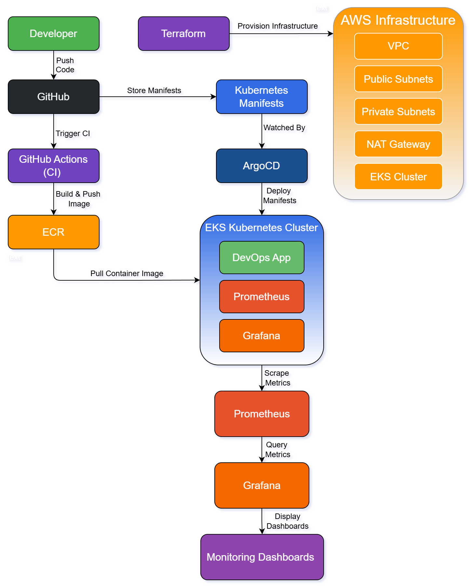

# Production-Style Kubernetes Platform on AWS (Terraform + GitOps + Observability)

## Overview
This project demonstrates the design, deployment, and operation of a production-style Kubernetes platform on AWS using Infrastructure as Code, GitOps, CI/CD, and observability tooling.

The platform infrastructure is provisioned with Terraform and deploys a Kubernetes cluster on Amazon EKS. Applications are containerized with Docker, built and pushed to Amazon ECR through a GitHub Actions CI pipeline, and deployed to the cluster using ArgoCD following a GitOps workflow.

Platform observability is provided through Prometheus and Grafana, enabling monitoring of cluster workloads and infrastructure metrics. Alerting and operational runbooks are included to simulate real-world incident response and on-call procedures.

The repository is structured to reflect a realistic platform engineering workflow, including infrastructure provisioning, container build automation, GitOps-based deployments, monitoring, alerting, and operational documentation.

The goal of this project is to demonstrate practical DevOps engineering skills across the full platform lifecycle: designing infrastructure, deploying and operating services in a cloud-native environment, implementing CI/CD automation, and maintaining operational reliability through monitoring and documented incident response.

## Architecture

  

## Technilogies Used

AWS
Terraform
Kubernetes (EKS)
Docker
ArgoCD
Prometheus
Grafana
GitHub Actions

## Infrastructure Flow

1. Terraform provisions networking
2. EKS cluster is created
3. Docker image built via GitHub Actions
4. Image pushed to ECR
5. ArgoCD deploys application
6. Prometheus collects metrics
7. Grafana visualizes metrics
8. Alertmanager handles incidents

## CI/CD Pipeline

## Monitoring

## Alerting

## Runbooks

## Cost Estimate

## Future Improvements

